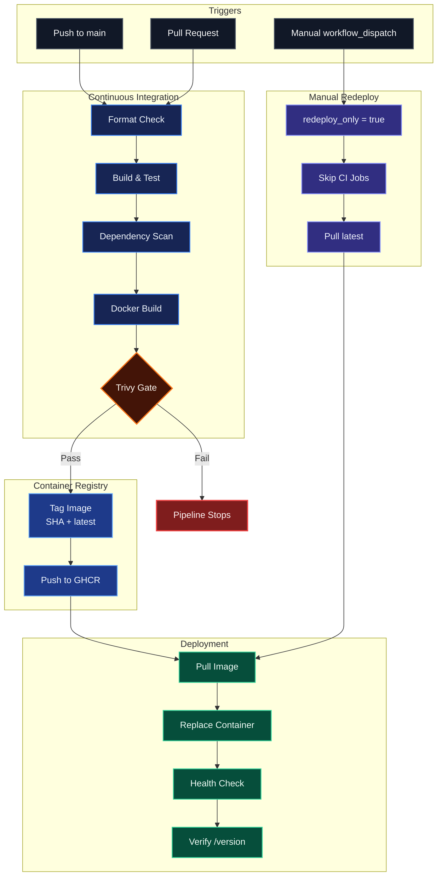

# CI/CD Pipeline

```mermaid
flowchart TB

    %% ---------- TRIGGERS ----------
    subgraph TRIGGERS["Triggers"]
        direction LR
        PUSH["Push to main"]
        PR["Pull Request"]
        MANUAL["Manual workflow_dispatch"]
    end

    %% ---------- CI ----------
    subgraph CI["Continuous Integration"]
        direction LR
        FORMAT["Format Check"]
        BUILD["Build & Test"]
        DEPS["Dependency Scan"]
        DOCKER["Docker Build"]
        TRIVY{"Trivy Gate"}
    end

    %% ---------- REGISTRY ----------
    subgraph REGISTRY["Container Registry"]
        direction LR
        TAG["Tag Image<br/>SHA + latest"]
        GHCR["Push to GHCR"]
    end

    %% ---------- DEPLOYMENT ----------
    subgraph DEPLOY["Deployment"]
        direction LR
        PULL["Pull Image"]
        REPLACE["Replace Container"]
        HEALTH["Health Check"]
        VERSION["Verify /version"]
    end

    %% ---------- MANUAL REDEPLOY ----------
    subgraph REDEPLOY["Manual Redeploy"]
        direction LR
        FLAG["redeploy_only = true"]
        SKIP["Skip CI Jobs"]
        LATEST["Pull latest"]
    end

    %% ---------- FAILURE ----------
    STOP["Pipeline Stops"]

    %% ---------- MAIN FLOW ----------
    PUSH --> FORMAT
    PR --> FORMAT

    FORMAT --> BUILD
    BUILD --> DEPS
    DEPS --> DOCKER
    DOCKER --> TRIVY

    TRIVY -->|Fail| STOP
    TRIVY -->|Pass| TAG

    TAG --> GHCR
    GHCR --> PULL
    PULL --> REPLACE
    REPLACE --> HEALTH
    HEALTH --> VERSION

    %% ---------- MANUAL FLOW ----------
    MANUAL --> FLAG
    FLAG --> SKIP
    SKIP --> LATEST
    LATEST --> PULL

    %% ---------- STYLES ----------
    classDef trigger fill:#111827,stroke:#4b5563,color:#f9fafb,stroke-width:1.5px;
    classDef ci fill:#172554,stroke:#3b82f6,color:#eff6ff,stroke-width:1.5px;
    classDef gate fill:#431407,stroke:#f97316,color:#fff7ed,stroke-width:2px;
    classDef registry fill:#1e3a8a,stroke:#60a5fa,color:#eff6ff,stroke-width:1.5px;
    classDef deploy fill:#064e3b,stroke:#34d399,color:#ecfdf5,stroke-width:1.5px;
    classDef manual fill:#312e81,stroke:#818cf8,color:#eef2ff,stroke-width:1.5px;
    classDef fail fill:#7f1d1d,stroke:#ef4444,color:#fef2f2,stroke-width:2px;

    class PUSH,PR,MANUAL trigger;
    class FORMAT,BUILD,DEPS,DOCKER ci;
    class TRIVY gate;
    class TAG,GHCR registry;
    class PULL,REPLACE,HEALTH,VERSION deploy;
    class FLAG,SKIP,LATEST manual;
    class STOP fail;
```
