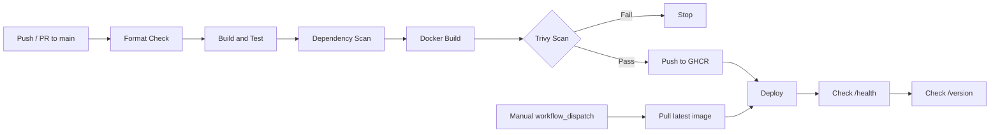

# CI/CD Pipeline

The jobs are chained with `needs:` in `ci.yml`.

The dependency scan is mainly for reporting. The Trivy scan is the security gate before the image is pushed and deployed.

The manual workflow can redeploy the last published image without rebuilding it.
