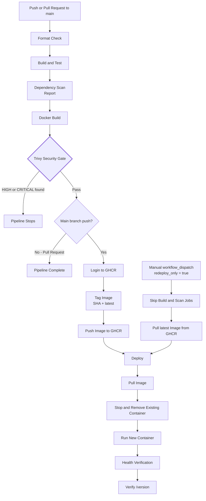

# CI/CD Pipeline



## Job Dependencies

The GitHub Actions jobs use `needs:` to enforce this order:

```text
format
  ↓
build
  ↓
dependency-scan
  ↓
docker-build-and-scan
  ↓
deploy
```

If an upstream gate fails, the dependent jobs do not continue.

## Security Gates

- Formatting must pass before build/test.
- Build/test must pass before dependency scanning.
- Trivy scans the final container image for `HIGH` and `CRITICAL` vulnerabilities.
- Trivy uses `exit-code: 1`, so detected vulnerabilities fail the pipeline.
- Deployment only occurs after the required gates succeed.

## Reporting vs Gating

The NuGet dependency scan is primarily used as a dependency vulnerability report.

The Trivy image scan is the enforced security gate before publishing and deployment.

## Deployment Behavior

On a successful push to `main`:

```text
Build image
→ Scan image
→ Push SHA-tagged image to GHCR
→ Push latest tag to GHCR
→ Pull image
→ Replace running container
→ Verify /health
→ Verify /version
```

For a manual redeployment:

```text
workflow_dispatch
→ redeploy_only = true
→ Build jobs skipped
→ Pull latest image
→ Replace container
→ Verify deployment
```

This allows the last successfully published image to be redeployed without creating a new commit or rebuilding the application.
